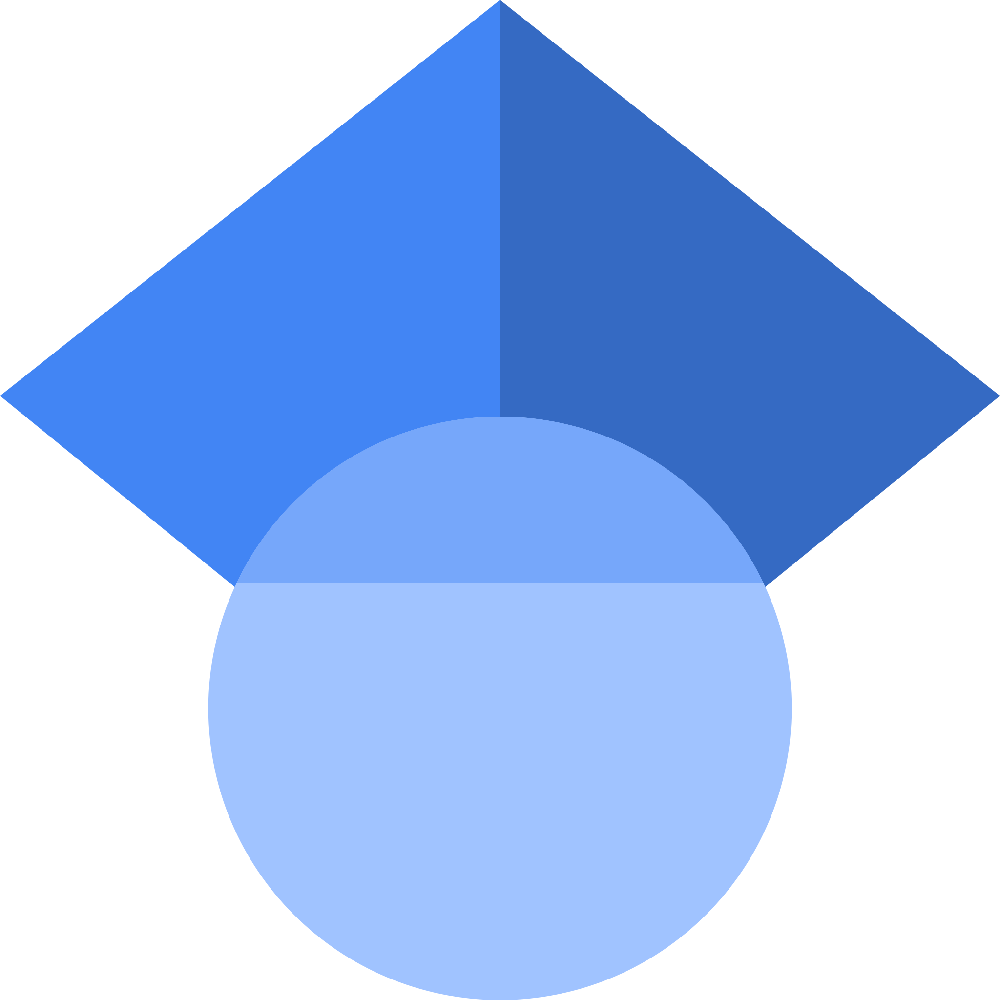

Email: kxzheng [at] Stanford [dot] edu
<!-- * [Linkedin](https://www.linkedin.com/in/kristine-zheng)
* [Twitter](https://x.com/kristinez_) 
* [Github]() -->

    
    <a id="scholar-contact" href="https://scholar.google.com/citations?user=sPHe8J4AAAAJ&hl=en&oi=ao"><u>google scholar</u></a>

		

			
			<a id="X (formerly Twitter)" href="https://x.com/kristinexzheng"><u>twitter</u></a>
		

	

	

		

			
			<a id="linkedin-contact" href="https://www.linkedin.com/in/kristine-zheng"><u>linkedin</u></a>
		

	

	<!-- 

		

			
			<a id="github-contact" href="https://github.com/erik-brockbank"><u>github</u></a>
		

	
 -->