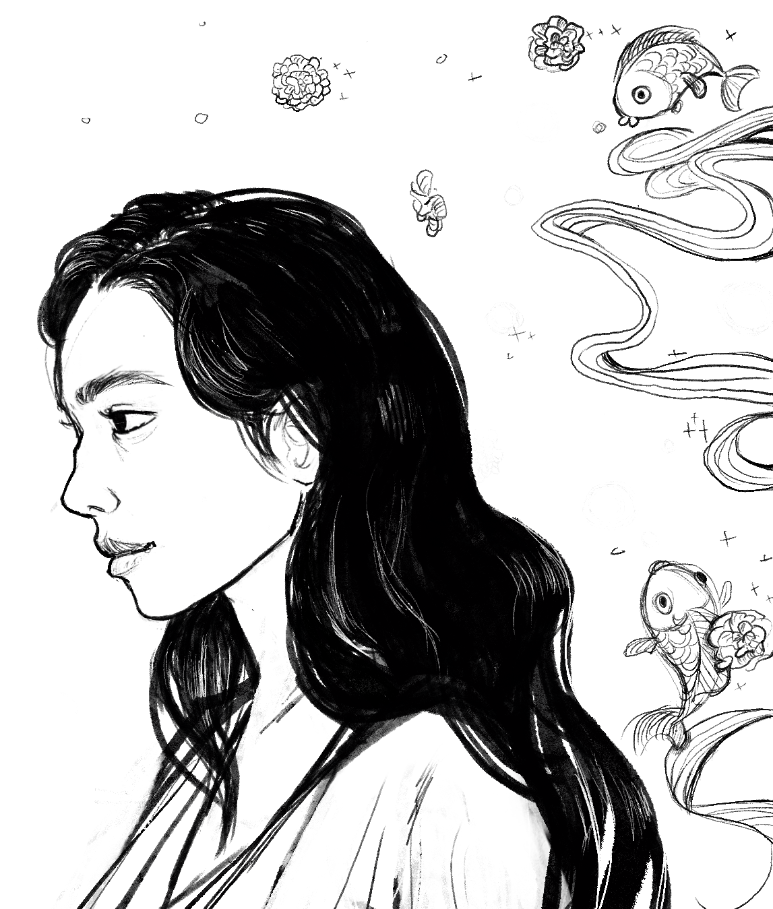

# #3 creating, gleaning, learning, & adulthood

1. [creating](#creating)
2. [gleaning](#gleaning)
3. [learning](#learning)
4. [adulthood](#adulthood)

## creating

* Following a Bob Ross tutorial to try to get over a sense of perfectionism in art ... jk they are really meant for traditional art and the painting techniques are difficult to implement with procreate. 
* I did make a nice drawing though! It references carnations and fish featured in old drawings. It is *the beginning* of creating again. (P.S. the person in the drawing is from pinterest!) 

© Kristine X. Zheng 2025

## gleaning

* [The Gleaners & I](https://en.wikipedia.org/wiki/The_Gleaners_and_I) directed by Agnès Varda 
* [The Gleaners (1857)](https://en.wikipedia.org/wiki/The_Gleaners) by Jean-François Millet

It is sort of interesting to define what *gleaning* is and how it differs from foraging, harvesting, etc. 

## learning 

*coming soon!*

## adulthood 

*coming soon!*

------------
Last updated: 04/03/2025
Created: 02/16/2025

[Back to the full garden!](./index.md)