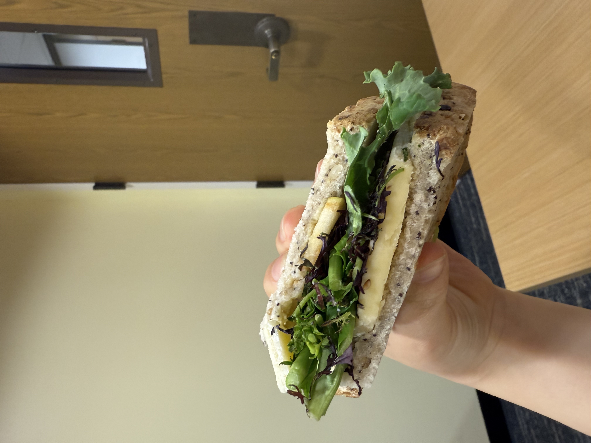
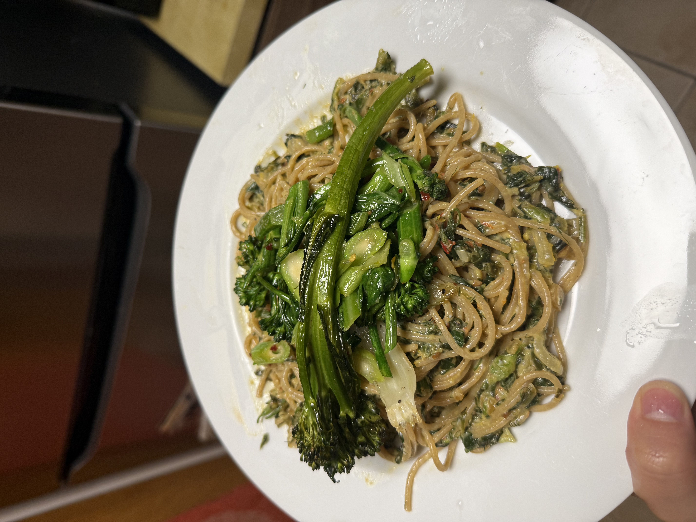
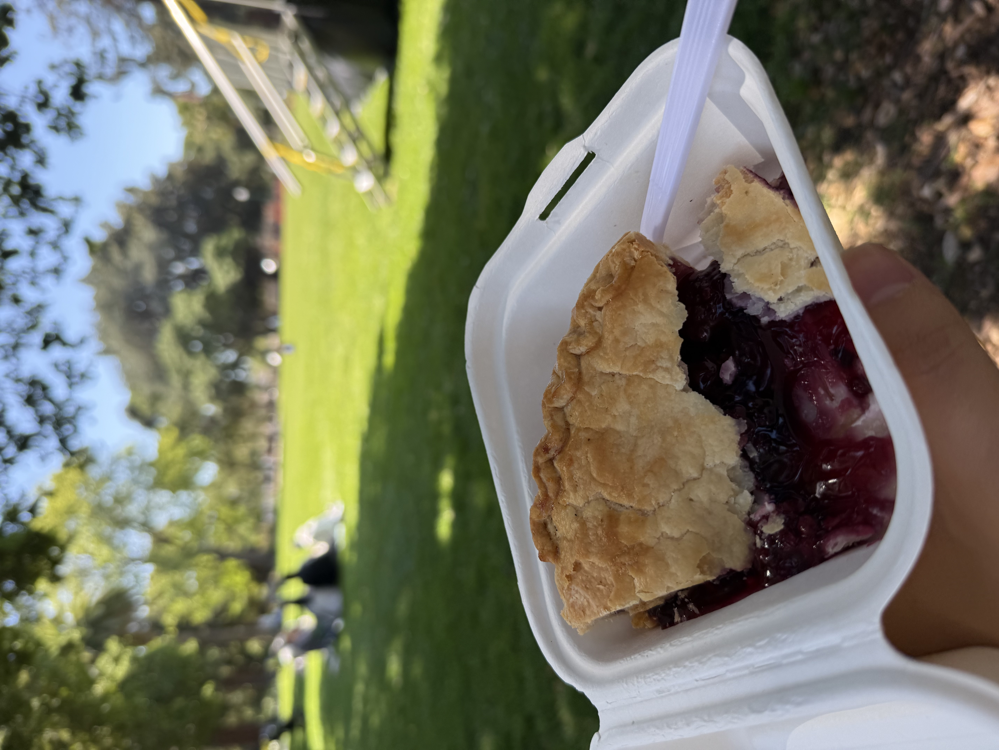

# #9 short writings about food and nature

1. [a love letter to bitterness and sharpness](#a-love-letter-to-bitterness-and-sharpness)

2. [american pie](#american-pie)

## a love letter to bitterness and sharpness

My favorite stand at the farmer’s market is tucked into a bend, probably the second to last on the street. Grant, I believe from our venmo transactions, is typically the dealer at the stand. They sell a number of different vegetables but I beeline towards their mix-and-match greens (actually green, red, and purple) for ten dollars a pound. Mustard, arugula, purslane, mizuna, kale. I love having a variety of greens both in texture and flavor. They can be frilly, hearty, crunchy, fleshy, slimy. Many of them taste bitter, sharp, spicy, and even acidic. 

I will be the first to say that I actually dislike most lettuces, especially in salads and sandwiches, because they aren’t very fun or flavorful to eat. Lettuce is a good filler or vessel for other foods but doesn’t do enough for me in most applications. Arugula is typically my favorite because of its nutty and complex flavor (I don’t really find them spicy most of the time) but this mix of greens is the best and goes wonderfully with any sort of mixed bowl meal (with barley, other veg, etc). I’ve also made a nice seasoned banchan-like dish with wilted greens, sesame oil, and soy sauce. Today, I put a handful of the mixed greens in a sandwich with sweet and crisp market apples (borrowed from a roommate), thick slices of dubliner cheese (salty, sort of crumby, and rich), dijon mustard (salty and spicy), and seedy sourdough. A side of green olives, cornichons, and the remaining apple half rounded out the meal. 

I think there is something about the complexity of bitterness and sharpness, especially in condiments, spices, brews, and greens, that I’ve grown to savor more and more. Sweet, creamy, or bland foods are still appealing but sometimes they can be a bit queasy and too rich. 

I’ve actually never spent over four dollars per visit to the greens stand. The greens are fairly light and voluminous. It is truly a small price to pay for the interesting flavors I get in mundane packed lunches and the nutrients the greens probably contain. 

<!-- In Spain, my sister and I did a sort of hopping on the last day; we found some casual bars with ice cold beers and savory bites. We had these really acidic and briny gildas: bar skewers with olives, pickled peppers, and anchovies.  

 -->

update 03/26:
I wrote this and immediately proceeded to eat more bitter greens for dinner and lunch. For dinner, I had a lovely whole wheat pasta with spice (red pepper flakes, pickled pepper, calabrian chili paste), citrus (preserved lemon + fresh lemon juice & zest), and greens (broccolini, gai lan, spinach, and fennel) emulsified with an egg (think the creamy richness of carbonara). 

For lunch, I had some leftover cooked greens from dinner mixed with raw leafy greens and toppings: mustard, cheese chunks, and walnuts. 

It isn't particularly surprising to me that I have decided to pursue these flavors recently. Some of my favorite dishes to this day are slightly charred green vegetables (kale, broccoli, chard) with soy sauce, garlic, and red pepper flakes. My parents also liked making bitter melon at times and I especially liked when it was stir fried with tons of red pepper and salt. During a ski trip a few weeks ago, we made a large kale salad with kumquats, cheese, radish and a mustard/kumquat dressing. I took the leftover kale stems and radish greens and cooked them in the same way with red pepper and salt. My roommate A also made a delicious sauteéd chard with mustard a while back. 

Bitter greens are a great source of nutrients and we could probably all eat more of them! I am of the belief that most foods (especially vegetables) can be quite tasty with the right preparation! 

*Bitterness and sharpness here refer to different (leafy) greens along with different pairings of strong cheese, acidic citrus/vinegar, briny pickles, fermented sauces, spicy pepper/mustard, etc.* 

## american pie

**(originally written 04/20/2025)**

I thought that the boysenberry pie from Heidi’s pie was going to be like a Midwest grocery store pie from my childhood—sugary gooey filling and thick doughy crust—which I adore and yearn for often. They are my quintessential American pie. 

Heidi’s boysenberry pie is filled with sweet, gooey, and juicy berries but the crust is actually shockingly buttery, layered, and crumby. Not like a croissant or puff pastry but like the best version of itself. I missed pie. I don’t want any more pastries with fun fusion fillings and picture perfect egg brushed lamination. 

Pies remind me of colder seasons in Michigan. They could be breakfast rushed before school when paired with milk. They could be dessert during a holiday potluck with family friends. 

In college, we increasingly learned about the horrors and wonders of free will. A tradition was born to Instacart deliver a pumpkin pie with whipped cream from Costco as soon as it hit the shelves. These pies are massive and glorious. The crust is of course cold and doughy as all good pies should be, and the filling is jiggly and lightly spiced. We would ceremoniously eat the first slices together then leave the rest for individual emotional support between psets, projects, and exams. 

------------
Last updated: 04/22/2025
Created: 03/25/2025

*Warning: I'm not using spellcheck !!!* 

[Back to the full garden!](./index.md)