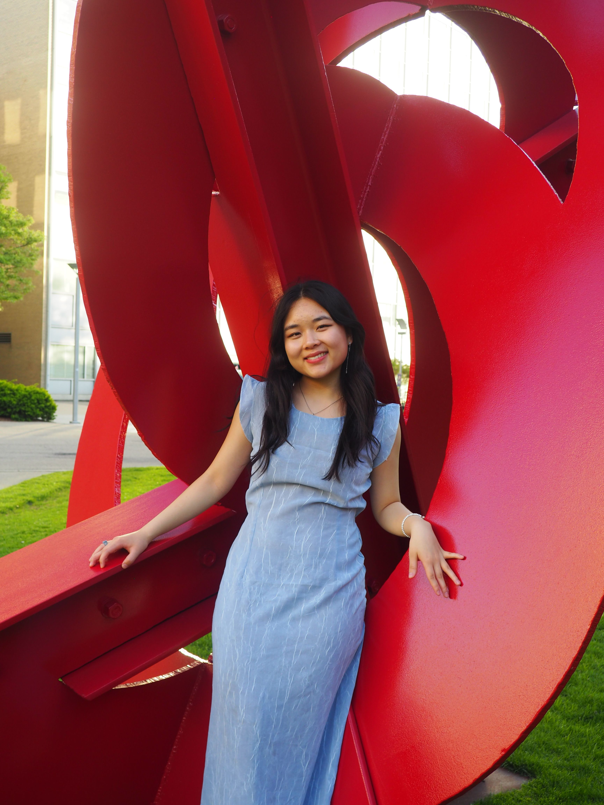

## About 

Hi! I am currently a research fellow at Stanford with [**Judy Fan**](https://cogtoolslab.github.io/) (Cognitive Tools Lab). I work on experiments and models for understanding visualization and advancing statistics literacy in formal education. Other research projects and interests (i.e. drawings, intuitive physics) include how humans perceive, learn, represent, and predict scenes in the physical world. 

Previously, I studied Computer Science and Brain & Cognitive Science at MIT with a minor in Women's & Gender Studies. During my time there, I explored cognition & development with [**Josh Tenenbaum**](https://cocosci.mit.edu/), [**Laura Schulz**](https://eccl.mit.edu/) and [**Vivian Paulun**](https://www.mit.edu/~vpaulun/index.html). I previously modeled vision with [**Jim DiCarlo**](https://dicarlolab.mit.edu/) and [**Kohitij Kar**](https://kohitij.com/). I also spent a wonderful summer at Princeton studying reinforcement learning with [**Yael Niv**](https://nivlab.princeton.edu/).

 
 
 

<!-- ---
layout: default
is_contact: true
--- -->

---
## Contact

Please reach out if you have any questions or want to chat! 

**Email:** kxzheng [at] Stanford [dot] edu

    
    <a id="scholar-contact" href="https://scholar.google.com/citations?user=QzfvdvYAAAAJ&hl=en"><u>google scholar</u></a>

    
    <a id="X (formerly Twitter)" href="https://x.com/kristinexzheng"><u>X (twitter)</u></a>

	

    
    <a id="linkedin-contact" href="https://www.linkedin.com/in/kristine-zheng"><u>linkedin</u></a>

<!-- This is a jekyll based resume template. You can find the full source code on [GitHub](https://github.com/bk2dcradle/researcher) -->

<!-- ## Research Interest -->
<!-- Lorem ipsum dolor sit amet, consectetur adipiscing elit. Aliquam finibus ipsum ac erat aliquam dapibus. Vestibulum vehicula placerat ex, a consectetur odio pharetra quis. Mauris id urna ante. Fusce pharetra diam ac nisi aliquet, vel egestas ex iaculis. Pellentesque laoreet cursus tellus sed pellentesque. Praesent a rhoncus elit. Nunc ipsum nisl, consequat sit amet pretium quis, gravida id ipsum. -->

<!-- ## Publications

1. F.Bar, J.Doe: Effects of having a placeholder of a name
2. S.Holmes, J.Watson: Consequences of living with a sociopath in London
 -->

<!-- ## Typography

This is a [link](http://google.com). Something *italics* and something **bold**.

Here is a table

Year | Award | Category
-----|-------|--------
2014 | Emmy  | Won Outstanding Lead Actor in a miniseries or a movie
2015 | BAFTA | Nominated for Best Leading Actor for Sherlock
2014 | Satellite | Won Best Actor miniseries or television film

Here is a horizontal rule

--- -->

<!-- Here is a blockquote

> To a great mind, nothing is little

## References

* Foo Bar: Head of Department, Placeholder Names, Lorem
* John Doe: Associate Professor, Department of Computer Science, Ipsum -->
